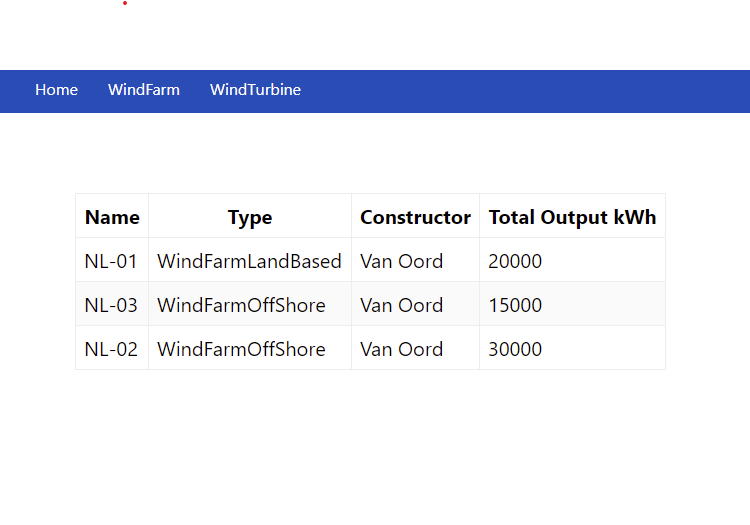
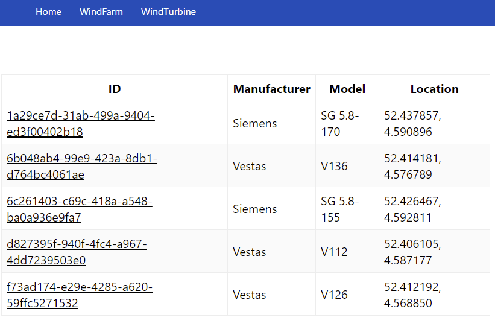
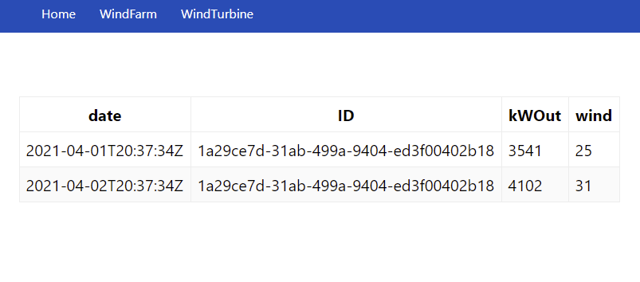
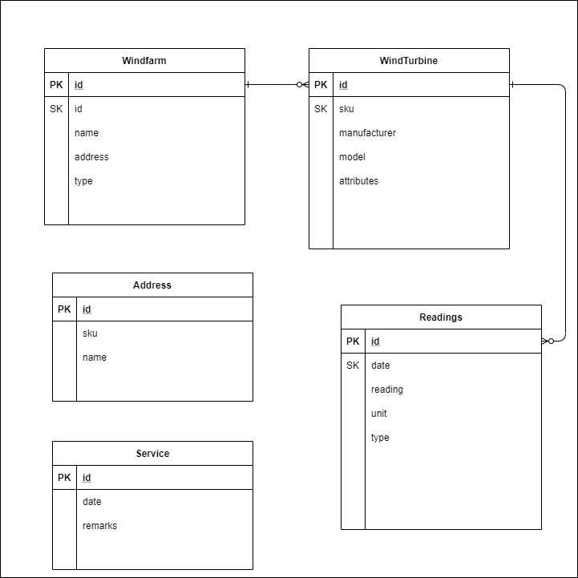

# Windfarm - Polymorphic Table Demo

Similair to the [SheepFarm demo Next.js app](https://https://github.com/dariusjs/sheepfarm) the Windfarm simulates a use case where we have a Wind Farm Management User Interface (UI).

The UI allows us to view Windfarms under management as well as Wind Turbines assigned to each Wind Farm. Clicking through the Wind Farm page we can then view readings of the Wind Turbine. This last part still needs refinement as I need to figure out Next.js Link referencing properly so I've hardcoded only one Turbine for now :)

The code in this application is not produciton ready. A lot of concerns need to be taken care of for production such Paging through records, routing data through an API and caching data.

## Examples of the WindFarm







## Requiurements
* installed docker
* yarn
* nodejs runtime
* an available (dummy )AWS credential set for the data preload scripts.

## Getting Started

TLDR; of getting started just hit:

```
yarn devDb
```

## Required Local DynamoDB
The project requires a local DynamoDB which can be executed through either:

```
yarn dynamo

or 

sudo docker run  -p 8000:8000 amazon/dynamodb-local -jar DynamoDBLocal.jar -sharedDb
```

## Run the Next.js server

Once the Data is preloaded you can then run the next.js server or skip the above step and just run yarn devDb which will also preload the data at the same time.

```
yarn dev

or 

yarn devDb  (to preload the DynamoDB at the same time)
```

Open [http://localhost:3000](http://localhost:3000) with your browser to see the result.

### Designing DynamoDB tables 

With DynamoDB there are some design principles to follow. You should model your schema into a Diagram, comonly done as an Entity Relationship Diagram. Then you should describe some access patterns. In our case we can come up with these access patterns:

* I want to view all my Wind Farms
* I want to view all my Wind Turbines
* I want to view the details of my Wind Turbines


With this we can then start modelling something onto DynamoDB Workbench. I've provided a sample Workbench file which we use to process the contents into our local DynamoDB model https://docs.aws.amazon.com/amazondynamodb/latest/developerguide/workbench.html


### DynamoDB WorkBench File
We have a DynamoDB Workbench file that can be used to preload sample data into the local DynamoDB file.

[WorkBench FIle](./architecture/windfarm.json)

### WindFarm Entity Relationship Diagram

